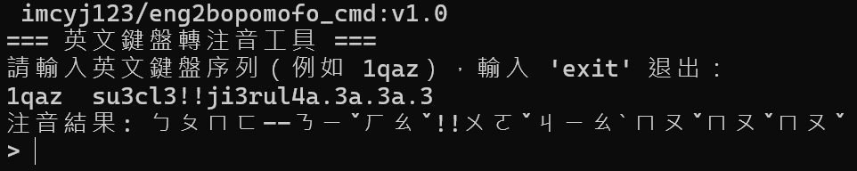
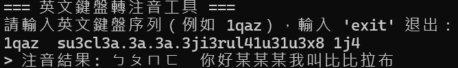

# Eng2Bopomofo (英文輸入 ➜ 注音轉換器)

<!-- 徽章區：建議對齊並分類 -->
<p align="center">
  
  
  
  
</p>

<p align="center">
  <strong>當您忘記切換輸入法時的救星！將鍵盤亂碼一鍵還原為注音符號。</strong>
</p>

---

## 📖 目錄
- [✨ 核心功能](#-核心功能)
- [🚀 v1.0.1 更新亮點](#-v101-更新亮點-whats-new)
- [📦 快速開始](#-快速開始-使用-docker)
  - [模式 A：互動模式](#模式-a互動模式-cmd-mode)
  - [模式 B：檔案批次模式](#模式-b檔案批次模式-file-mode)
- [📂 專案結構](#-專案結構)

---

## ✨ 核心功能

*   **💬 互動模式 (Interactive)**：即時轉換終端機輸入。
*   **📂 檔案模式 (Batch File)**：支援 `input.txt` 大量轉換，自動輸出 `output.txt`。
*   **🐳 容器化支援**：無需安裝 Java 環境，支援 Docker / Docker Hub 跨平台執行。

---

## 🚀 v1.0.1 更新亮點 (What's New)

在最新版本中，我們針對 **執行時間從 600秒 縮短至 60秒，處理速度提升了 900 %、還會陸續更新教育部注音索引、排版優化、支援更多符號** 進行了優化。

### 版本差異對照

|        v1.0.0 (舊版)         |            v1.0.1 (最新版)            |
|:--------------------------:|:----------------------------------:|
|  |  |
|  *舊版只能呈現注音 以及 ` `換變成`-`*   |       *新版優化辭庫(按照教育部辭典進行更新)*        |

> 我修復了在 v1.0 中 `只有注音`以及 `空格轉換問題` 的 Bug，並提升了 **900** % 的處理速度。

---

## ⚡ 快速開始 (使用 Docker)

確保已安裝 [Docker Desktop](https://www.docker.com/products/docker-desktop/)。

### 模式 A：互動模式 (CMD Mode)
**無需 Clone 專案，直接執行：**

```bash
docker run -it --rm imcyj123/eng2bopomofo_cmd:v1.0.1
```

### 模式 B：檔案批次模式 (File Mode)
**需要 Clone 專案以配置檔案：**

1. **Clone & 進入目錄**
   ```bash
   git clone https://github.com/imcyj123/Eng2Bopomofo.git
   cd Eng2Bopomofo/file-mode
2. **準備檔案**：將內容放入 `data/input.txt`。
3. **執行轉換**：
    - **Mac/Linux**: 
     ```
   docker run --rm -v "$(pwd)/data:/app/data" imcyj123/eng2bopomofo_file:v1.0.1
     ```
    - **Windows**: 
   ```
    docker run --rm -v "${PWD}/data:/app/data" imcyj123/eng2bopomofo_file:v1.0.1
   ```

---

## 📂 專案結構

```text
Eng2Bopomofo/
├── file-mode/              # 📂 檔案處理模式
│   ├── data/               # 數據輸入/輸出區
│   │   ├── input.txt       # 📥 來源文字 (UTF-8)
│   │   └── output.txt      # 📤 轉換結果
├── cmd-mode/               # 💬 CMD 互動模式
└── README.md               
```